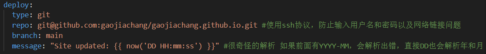

### 新建文章
在_config.yml中配置`post_asset_folder: true`则使用`hexo new "articalName"`新建文章时，会自动生成同名资源文件夹。建议将文章md文件拖入该文件夹，这样就可以使用vscode的markdown插件的自动粘贴图片功能，写完后将文章md文佳佳你拖出来，再改一下图片路径即可。

### 一键部署  
使用ssh协议，在已经配置好的情况下，如图：

先输入`hexo clean`指令，清理原页面，然后输入`hexo deploy`一键部署

### 上传github
因为页面库和代码库是两个库，莫要忘记上传github。