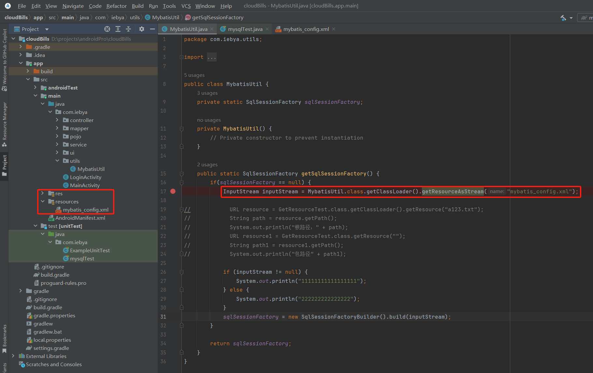

### 先说一个致命bug，卡了我4个小时有余，最后发现竟如此微小
一开始，我把mybatis配置文件放到res里了，结果一致报错，报错信息类似是“connection failure”。后来逐步排查，发现问题是因为inputstream为空，也就是说找不到配置文件。  
  
解决办法就是新建resources文件夹，将xml文件丢里面就可以了。getClassLoader().getResourceAsStream()方法的默认加载类路径是resources！因为android studio默认是res，所以居然不兼容，我真是服了。

> 下面讲解mybatis的配置与使用
### 1.配置mybatis数据库链接
在resources文件夹下新建mybatis_config.xml文件，内容如下：
```xml
<?xml version="1.0" encoding="UTF-8" ?>
<!DOCTYPE configuration PUBLIC "-//mybatis.org//DTD Config 3.0//EN"
    "https://mybatis.org/dtd/mybatis-3-config.dtd">
<configuration>
    <environments default="dataSource">
        <environment id="dataSource">
            <transactionManager type="JDBC"/>
            <dataSource type="POOLED">
                <property name="driver" value="com.mysql.cj.jdbc.Driver"/>
                <property name="url" value="jdbc:mysql://8.130.97.108:3306/cloud_bills"/>
                <property name="username" value="newuser"/>
                <property name="password" value="iebya0612BUPT"/>
            </dataSource>
        </environment>
    </environments>
    <mappers>
        <mapper class="com.iebya.mapper.UserMapper"/>
    </mappers>
</configuration>
```  
这里注意，`<mapper>`标签，当我们使用@Select等注解时，这个标签要这么写:
```xml
<mapper class="com.iebya.mapper.UserMapper"/>
```
而如果使用把sql语句写在xml文件里的方法，则要这么写：
```xml
<mapper resource="com/iebya/mapper/UserMapper.xml"/>
```
反正只要出现sql语句的地方，都要加入`<mappers>`标签，不然mybatis加载的时候找不到入口。

### 单例模式，配置MybatisUtil类
```java
public class MybatisUtil {
    private static SqlSessionFactory sqlSessionFactory;

    private MybatisUtil() {
        // Private constructor to prevent instantiation
    }

    public static SqlSessionFactory getSqlSessionFactory() {
        if(sqlSessionFactory == null) {
            InputStream inputStream = MybatisUtil.class.getClassLoader().getResourceAsStream("mybatis_config.xml");
            sqlSessionFactory = new SqlSessionFactoryBuilder().build(inputStream);
        }

        return sqlSessionFactory;
    }
}
```  
这里主要涉及到一个sqlSessionFactory的创建，这个类是mybatis的核心类，用于创建sqlSession，sqlSession是用于执行sql语句的。而sqlSessionFactory官方文档推荐一个项目创建一个就可以，全程使用。

### mapper接口
mapper层只需要定义接口，这里给个示范

```java
public interface UserMapper {
    @Select("select * from user where name = #{name} and password = #{password}")
    List<User> login(User user);
}
```

### service层使用mybatis
需要openSession；然后getMapper，用于给UserMapper接口实例化；用完closeSession，可以考试使用`try-with-resources`语法糖。
```java
@Test
    public void testMybatis() {
        SqlSession sqlSession = MybatisUtil.getSqlSessionFactory().openSession();
        UserMapper userMapper = sqlSession.getMapper(UserMapper.class);

        for(User user : userMapper.login(new User("a", "a"))) {
            System.out.println(user);
        }
    }
```