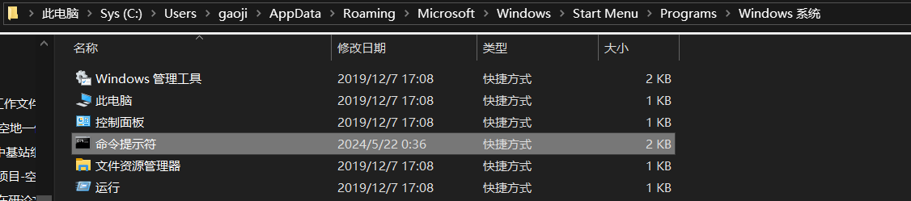
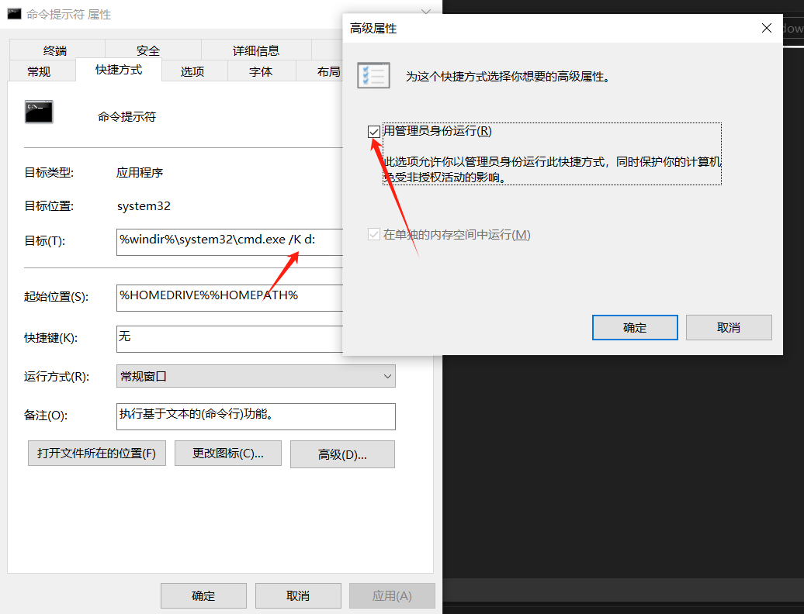
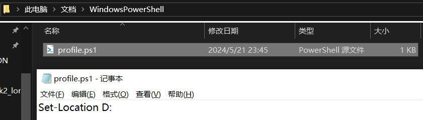
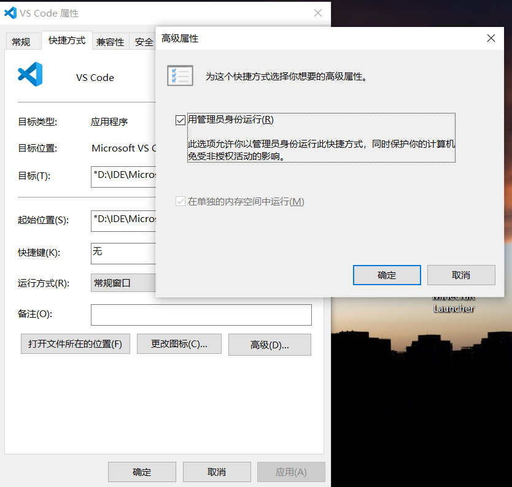

### cmd
通过win10的搜索“cmd”，找到cmd文件夹（这里仅是快捷方式），如图：
  
1. 右键->属性->高级->勾选用管理员身份运行
2. 在目标后加"/K d:",/K表示执行这个指令并不关闭窗口，d:表示切换到D盘

### powershell
先找到powershell文件夹，同cmd
1. 右键->属性->高级->勾选用管理员身份运行
2. 在这个位置“C:\Users\gaoji\Documents\WindowsPowerShell”下创建profile.ps1文件，内容为“Set-Location D:”

### vscode
管理员身份同上设置，此时在vscode内打开终端，便可以执行npm install这种命令啦

### 其他
1. ps1文件：类似cmd的.bat和linux的.sh文件，是powshell批处理文件
2. 设置自动管理员身份运行，只能针对快捷方式，无法直接设置exe文件
