### 基础概念
1. gradle存在一个包装器wrapper的概念，用于保证项目gradle版本的一致性，每次执行gradlew/gradlew.bat命令时，会自动下载对应版本的gradle，因此无需本地安装gradle，只需要在本地配置gradle的仓库即可。
2. gradle的本地仓库和maven的本地仓库不建议使用同一个，据csdn佬的说法，这么做会导致混乱。
3. 配置镜像时，分为两部分，一部分是配置gradle自身镜像（因为每次gradlew时会自动下载gradle嘛），一部分是配置gradle依赖镜像。
### 配置本地仓库
1. 在d盘新建文件夹gradle，在gradle下新建文件夹repository，如图：  
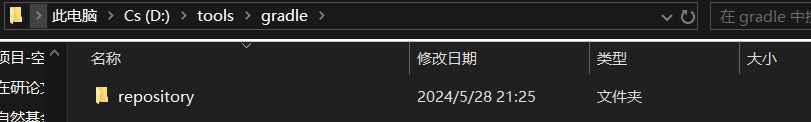
2. 配置环境变量`GRADE_USER_HOME`，值为repository文件夹的位置，亲测会自动被IDEA和AS识别，如图：  
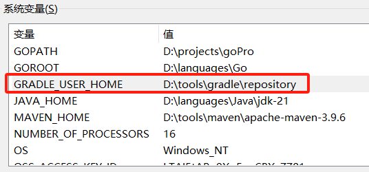
### IDEA配置gradle镜像
#### 新建gradle项目
新建gradle构建的java项目，如图所示选择，DSL选择groovy，Gradle Distribution选择wrapper，如图：
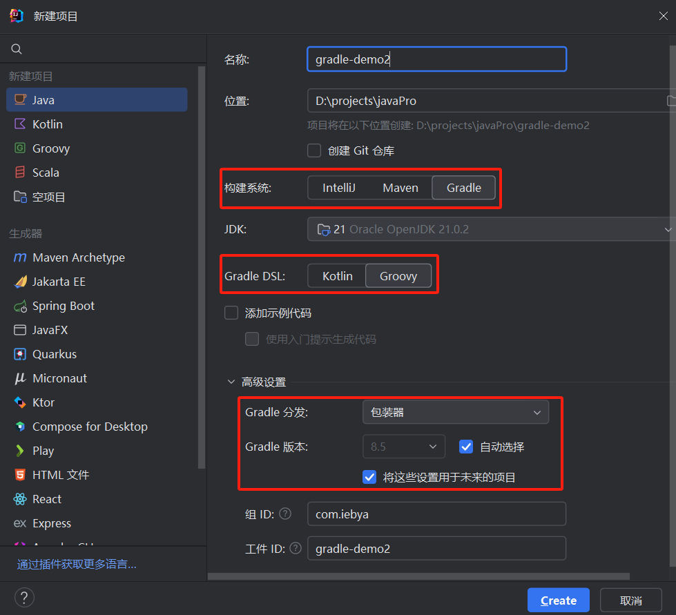  
点击创建后，IDEA会自动同步gradle，点击取消（因为使用他的默认源，会贼拉拉慢），在窗口底部，如图：
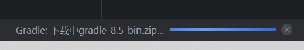
#### 配置gradle自身镜像
根目录/gradle/wrapper/gradle-wrapper.properties文件，修改distributionUrl为腾讯云镜像，如图：
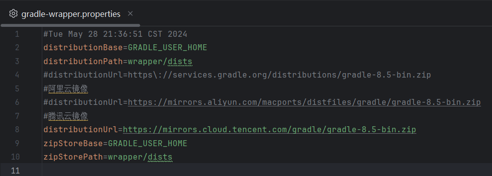  
1. 阿里云镜像  
`https://mirrors.aliyun.com/macports/distfiles/gradle`
2. 腾讯云镜像  
`https://mirrors.cloud.tencent.com/gradle`

建议使用腾讯云镜像，阿里云镜像慢得要死，大概1MB/s。
#### 配置gradle依赖镜像
根目录/build.gradle文件，修改repositories为腾讯云镜像，如图：  
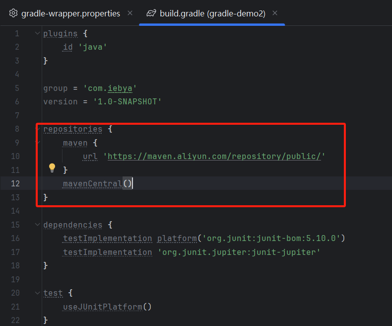  
1. 注意语法，这里是在gradle中配置maven仓库。
2. mavenCentral()是gradle默认的maven中央仓库。
3. 优先级顺序是从上至下，如果腾讯云镜像找不到依赖，会自动去maven中央仓库找。
```
repositories {
    maven {
        url 'https://maven.aliyun.com/repository/public/'
    }
    mavenCentral()
}
```
#### 同步gradle
点击此按钮，同步gradle，（亦有其他方法）如图：  
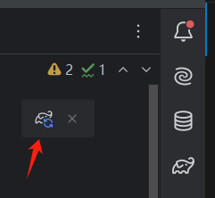

### AS配置gradle镜像
#### 新建gradle项目
如图，重点是选择groovy,项目语言kotlin和java都可以。
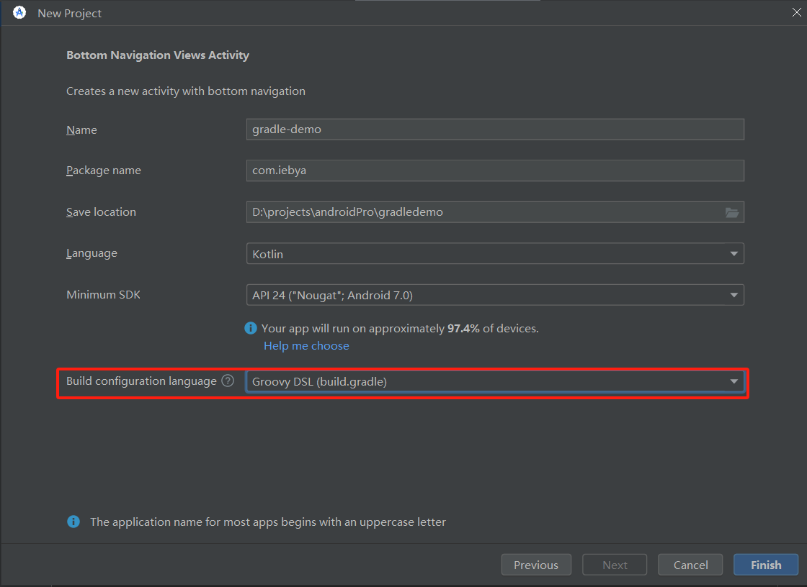  
进入后，同样会自动同步gradle，点击取消，如图：  
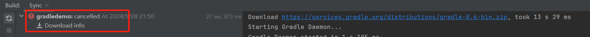
#### 配置gradle自身镜像
同上，不再展示
#### 配置gradle依赖镜像
这个与IDEA不太一样，不在build.gradle文件中配置，而是在项目根目录下的setting.gradle文件中配置，如图：  
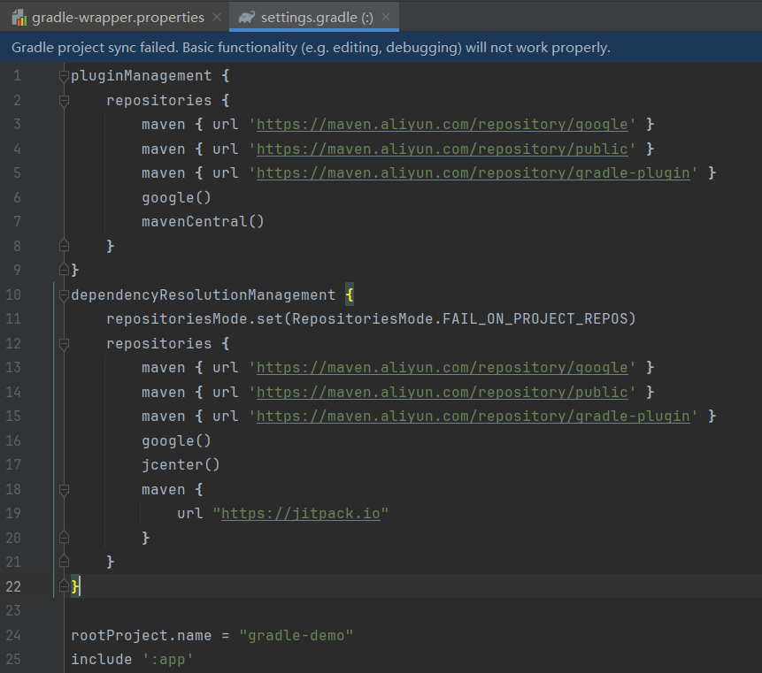  
可以发现，只配置阿里云的public仓库是不行的，还需要google仓库，在这里，这个主要是针对android开始使用。
```
pluginManagement {
    repositories {
        maven { url 'https://maven.aliyun.com/repository/google' }
        maven { url 'https://maven.aliyun.com/repository/public' }
        maven { url 'https://maven.aliyun.com/repository/gradle-plugin' }
        google()
        mavenCentral()
    }
}
dependencyResolutionManagement {
    repositoriesMode.set(RepositoriesMode.FAIL_ON_PROJECT_REPOS)
    repositories {
        maven { url 'https://maven.aliyun.com/repository/google' }
        maven { url 'https://maven.aliyun.com/repository/public' }
        maven { url 'https://maven.aliyun.com/repository/gradle-plugin' }
        google()
        jcenter()
        maven {
            url "https://jitpack.io"
        }
    }
}
```
#### 同步gradle
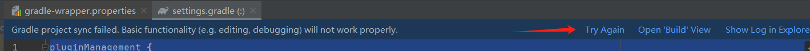

#### 补充
1. 因为使用gradle的wrapper，而这东西是一个jar文件，如图：  
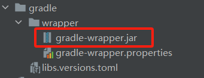  
所以，需要指定gradle jdk版本，我们在IDEA中指定了本地的jdk21，如图：  
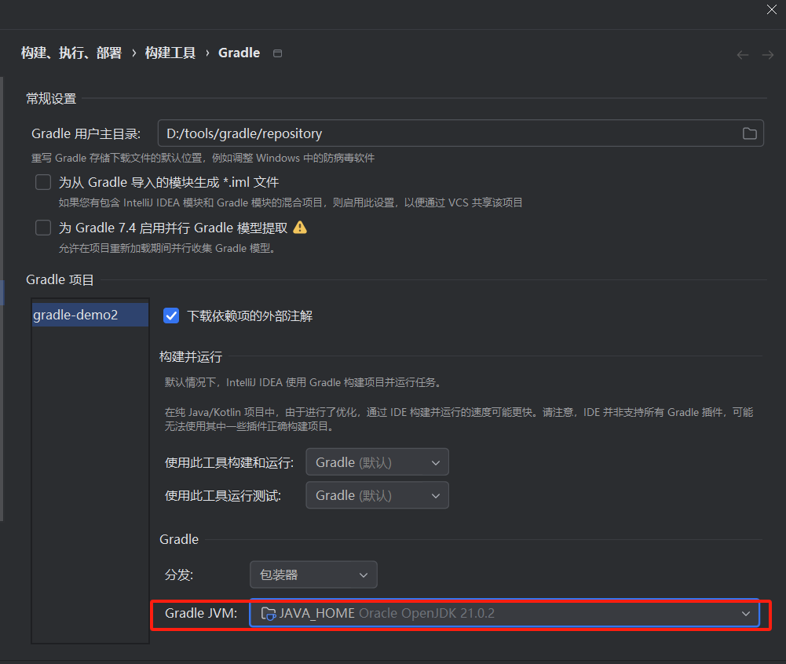  
而在AS中，我们使用Android Studio自带的jdk，如图：  
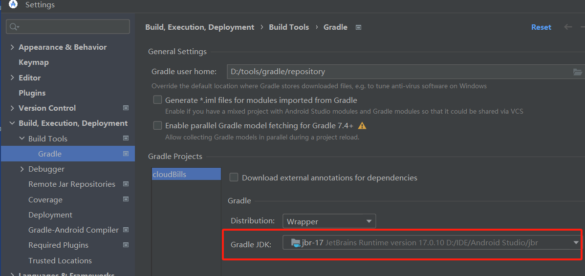  
2. 如果不指定gradle的repository路径，会自动装到C盘，用户目录下的.gradle文件夹。